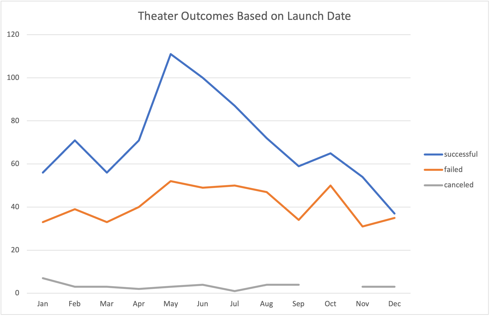
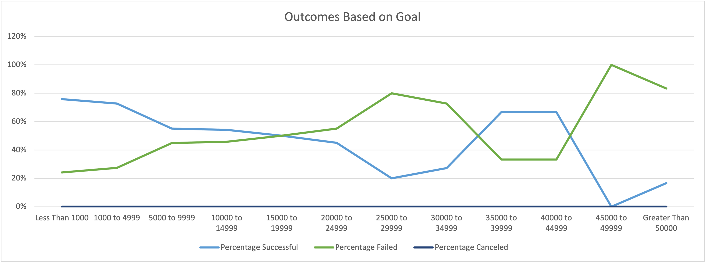

# Kickstarting with Excel

### Overview of Project
For this project, I analyzed the data of Kickstarter campaigns worldwide to uncover trends among Kickstarter project outcomes (successful, failed, or canceled) based on the parameters of a project's launch date as well as a project's monetary goal.

### Purpose
The goal of this project was to provide Kickstarter project outcome trends for my client, Louise, who is interested in launching a Kickstarter project of her own to fund a play. Through my analysis, I set out to provide Louise with relevant data from similar projects that would give her the information necessary to set a target goal amount and target project launch date with the best chance of success.

## Analysis and Challenges

### Analysis of Outcomes Based on Launch Date

The Kickstarter data file was filtered using a pivot table to show relevant Kickstarter campaigns in the theater parent category. Within this data set, I viewed the outcome results of these theater campaigns: successful, failed, or canceled. This outcome data was then filtered by years and grouped by month. This filtered data set allowed me to create a line chart which visually represented outcome trends based on the time of year a campaign was launched.

You can view the "Theater Outcome Trends Based on Launch Date" chart here:

### Analysis of Outcomes Based on Goals

In this analysis, I created a new worksheet to include Kickstarter campaign goal amounts ordered by amount ranges in $5,000 increments from less than $1,000 through greater than $50,000. Within these defined ranges, I pulled from the Kickstarter data file to total the number of campaigns within these ranges with a specific outcome of successful, failed, or canceled for Kickstarter campaigns with the subcategory "Plays". Once that data was retrieved using the COUNTIF() function, I then counted the total number of "Play" projects for each of the specified goal amount ranges. Once I had the total number of projects, I was then able to determine the percentage representation of each project outcome within the subcategory "Play" for all of the goal amount ranges. Once the percentage representation per outcome was determined, I concluded this analysis by generating a line chart which showed the percentage of each possible outcome compared to the total number of "Play" projects for each of the goal amount ranges. 

You can view the "Outcomes Based on Goal" chart here:

### Challenges and Difficulties Encountered

During my analysis of outcomes based on launch date, I identified a challenge when displaying the outcome data based on date of project creation. When filtering by this variable, I found that the pivot chart displayed each unique date of project creation in its own row. Viewing the data this way would not have been helpful in identifying commonalities in results based on a similar launch date within a calendar year. To give Louise the best understanding of when to launch her Kickstarter campaign, she needed to know when was the best time to launch it regardless of year (since she couldn't go back in time and launch in the most successful month and year within the data set!). I overcame this challenge by filtering the data of project creation row by month. This provided a more digestible format for reviewing trends based on launch date.

When populating rows cells within the Outcomes Based on Goal worksheet, I found it challenging to populate the COUNTIF() function across the different variables without a fair amount of manual editing. I did find that remembering to include the $ symbol within the data array to lock the array was helpful in copying the function to a new column. However, I found that I had to manually edit the outcome field for each row. When I tried to auto populate the next row, I was not receiving the correct result. Based on the challenges I found here, I’d like to research best practices for utilizing the COUNTIF() function to determine if there are more efficient ways of utilizing a similar COUNTIF() function across multiple rows. 

Additionally, I found that I had originally forgotten to include the subcategory filter for “plays.” This meant that I was counting projects across all subcategories vs. filtering down to the most relevant project type for the purpose of this project. While I did catch my mistake, it was a lesson learned in making sure to double check all analysis requirements to make sure no filters are missed.

## Results

- What are two conclusions you can draw about the Outcomes based on Launch Date?
  * The results of this analysis revealed that the month of May has the most theater Kickstarter projects with a successful outcome. May also has the greatest number of failed campaigns compared to other months. Overall, May is the most popular month for launching a theater Kickstarter campaign. However, the number of failed campaigns shouldn’t deter Louise from launching her campaign in May. There are more than double the amount of successful campaigns in May compared to losses; the greatest difference between successful and losing campaigns out of any month.
  * To give Louise more options for launching her Kickstarter campaign, the results showed that the warm weather months of May-July provide the greatest opportunity for success. The month that Louise should avoid most of all Is December, where the chance for a failed campaign in nearly even with the chance for success. 

- What can you conclude about the Outcomes based on Goals?
  * The greatest disparities between successful and failed campaign outcomes occurred at the most extreme ranges of campaign monetary goals. Around 80% of campaigns were successful when the monetary goal was less than $1,000, while only around 20% of campaigns failed at this goal range. Nearly the opposite is true when the monetary goal is above $50,000; around 80% of campaigns failed when the goal was at this range, compared to 20% which were successful. 
 * While the greatest chance for Louise to see a successful campaign is with a target funding goal of less than $1,000, Louise should feel good about the fact that the chance for success is also close to 70% when the goal amount is between $35,000 and $45,000. This provides Louise options for determining the best scope of her project. 

- What are some limitations of this dataset?
  * One limitation of this data set is that the range of data encompasses less than 10 years, with the most recent data coming from 2017, nearly 4 years ago. These results may not take into account more recent trends, especially considering the current Covid-19 pandemic which has affected spending behavior worldwide.
  * A second limitation to consider is that this data set does not include any demographic data associated with the backers for each project. So while Louise might know when is the best time to launch her Kickstarter campaign and the best target goal funding amounts to associate with her project, she won’t have much information on the type of people who are most likely to back a project like hers. This could lead to marketing campaigns that lack targeting and could result in an inefficient use of resources.

- What are some other possible tables and/or graphs that we could create?
  * Another chart that could provide useful would be an Outcome Based on Campaign Timeframe analysis. This would be similar to the Outcomes Based on Goals chart but instead of ranges based on target goal amount, the ranges would represent timelines based on number of months live. This would help Louise understand how long she should have her Kickstarter project open to give her the best chance of achieving success.
  * Louise could also benefit from a table that outlines the average number of backers and average donation size for projects similar to hers and within a similar target goal amount that achieved a successful outcome. This could help Louise set target donation amounts and focus developing backer incentives for the donation amounts that are most common for her project type. Additionally, it could help Louise to target her marketing efforts when she has a specific goal number of backers in mind.
